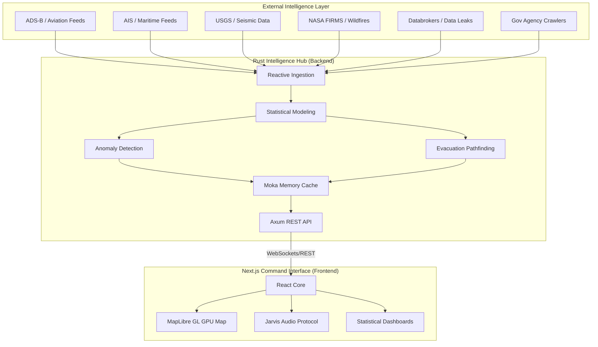

# Cleopatra ⬡

A high-performance OSINT and SIEM platform designed for deep situational awareness and person-based intelligence. Cleopatra is a complete architectural evolution of Osiris, optimized for scale and advanced statistical modeling.

## 🏛️ System Architecture

Cleopatra uses a decoupled, high-performance architecture designed to handle massive intelligence streams with minimal latency.



### Architectural Components:
- **Rust Backend (`/backend`)**: Built with `Axum` and `Tokio`. This is the high-concurrency engine that fetches data, runs statistical analysis, and detects anomalies in flight/maritime patterns.
- **Next.js Frontend (`/frontend`)**: A standalone React application optimized for visualization. It uses MapLibre GL for 60fps GPU-accelerated mapping.
- **Jarvis Audio Protocol**: A hardware-accelerated greeting system using the native Web Speech API to provide tactical audio feedback.
- **Containerization**: Managed via `docker-compose.yml` for seamless deployment of the full-stack environment.

## 👁️ Key Capabilities

### Person OSINT
Cleopatra continues its primary mission of tailored intelligence gathering on individual targets:
- **Registry Recovery**: Pull SSS Registry data and historical data-leakage signatures.
- **Government Liaison**: Scrape and correlate derogatory records from multiple official websites.
- **Employment Verification**: Determine current employer status via crawl-matching.
- **Financial Status**: Analyze records from Pag-ibig and Philhealth to assess financial stability.

### SIEM & Global Intel
- **Anomaly Detection**: Real-time statistical analysis of ADSB/AIS tracks to identify spoofing and high-risk deviations.
- **Evacuation Planning**: Dynamic routing logic that identifies safe corridors around active disaster/conflict zones.
- **Atmospheric Analysis**: Monitoring rapid pressure drops and atmospheric bursts correlated with severe events.

## 🚀 Getting Started

Ensure you have Docker and Docker Compose installed.

```bash
cd Projects/cleopatra
docker compose up -d --build
```

- **Dashboard**: `http://localhost:3000`
- **Backend API**: `http://localhost:8080`

## 🔒 Security
The project includes a root-level `.gitignore` that prevents the leaking of `.env` files, credentials, and local build artifacts. **Never commit raw secrets to the repository.**
